## 一、需求說明
系統功能:
1.	顧客下訂單
2.	訂單記錄下單時間、點了哪些飲品、每項數量
3.	可查詢熱銷飲品排行、顧客消費紀錄、每日營業額、每月銷售統計

重點查詢:

• 熱銷飲品排行

• 顧客消費紀錄

• 每日營業額

• 每月銷售統計（商品、商品數量、個別銷售總額、整體銷售總額）

## 二、ER 圖
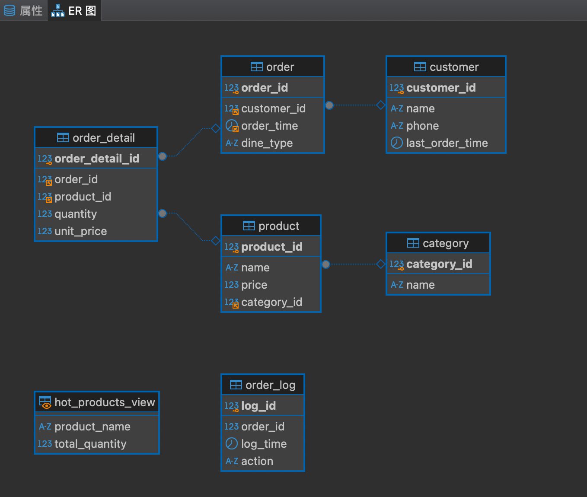

## 三、資料表結構
| 資料表       | 說明                                       |
|--------------|--------------------------------------------|
| customer     | 顧客基本資料：姓名、電話                 |
| category     | 飲品類別：咖啡、茶飲、果汁、奶昔 、冰沙      |
| product    | 飲品資料：名稱、單價、分類                |
| order        | 一筆訂單資料：下單時間、顧客ID、內用/外帶 |
| order_detail | 一筆訂單中的多筆飲品明細：商品、數量、價格 |

詳細資料表設計：
### 1. customer 顧客資料表
記錄顧客基本資訊（用於查詢個人消費紀錄）

| 欄位名稱 | 資料型別 | 說明 |
| -------- | -------- | -------- |
| customer_id|INT PRIMARY KEY AUTO_INCREMENT|顧客編號（主鍵）|
|name | VARCHAR(10)|顧客姓名|
|phone| VARCHAR(10)|顧客電話|

### 2. category 商品類別表
記錄飲品分類（例如：咖啡、茶飲、果汁、奶昔 、冰沙）
| 欄位名稱 | 資料型別 | 說明 |
| -------- | -------- | -------- |
| category_id|INT PRIMARY KEY AUTO_INCREMENT|類別編號（主鍵）|
|name | VARCHAR(10)|類別名稱|

### 3. product 商品資料表
記錄所有飲品資訊，關聯到類別

| 欄位名稱     | 資料型別                      | 說明                              |
|--------------|-------------------------------|-----------------------------------|
| product_id   | INT PRIMARY KEY AUTO_INCREMENT | 商品編號（主鍵）                  |
| name         | VARCHAR(10)                   | 商品名稱                          |
| price        | DECIMAL(6,2)                  | 單價                              |
| category_id  | INT                           | 外鍵 → category(category_id)     |

### 4. order 訂單資料表
記錄每一次點餐，包括顧客與下單時間，並加上內用/外帶選項

| 欄位名稱     | 資料型別                      | 說明                            |
|--------------|-------------------------------|---------------------------------|
| order_id     | INT PRIMARY KEY AUTO_INCREMENT | 訂單編號（主鍵）                |
| customer_id  | INT                           | 外鍵 → customer(customer_id)   |
| order_time   | DATETIME                      | 下單時間                        |
| dine_type    | ENUM('內用', '外帶')          | 用餐型態                        |


### 5. order_detail 訂單明細表
一筆訂單中的多個商品項目

| 欄位名稱     | 資料型別                      | 說明                                 |
|--------------|-------------------------------|--------------------------------------|
| order_detail_id | INT PRIMARY KEY AUTO_INCREMENT | 明細編號（主鍵）                  |
| order_id     | INT                           | 外鍵 → order(order_id)             |
| product_id   | INT                           | 外鍵 → product(product_id)         |
| quantity     | INT                           | 購買數量                             |
| unit_price   | DECIMAL(6,2)                  | 購買時的商品單價（為了保留歷史價格） |

### SQL匯出
建立資料庫及五個資料表
```sql
-- 建立資料庫（coffeeshopdb）
CREATE DATABASE coffeeshopdb;
USE coffeeshopdb;
```
```sql
-- 建立顧客資料表（customer）
CREATE TABLE customer (
customer_id INT PRIMARY KEY AUTO_INCREMENT,
name VARCHAR(10) NOT NULL,
phone VARCHAR(10) NOT NULL
);
```
```sql
-- 建立飲品類別表（category）
CREATE TABLE category (
category_id INT PRIMARY KEY AUTO_INCREMENT,
name VARCHAR(10) NOT NULL
);
```
```sql
-- 建立飲品資料表（product）
CREATE TABLE product (
product_id INT PRIMARY KEY AUTO_INCREMENT,
name VARCHAR(10) NOT NULL,
price DECIMAL(6,2) NOT NULL,
category_id INT,
FOREIGN KEY (category_id) REFERENCES category(category_id)
);
```
```sql
-- 建立訂單資料表（order）
CREATE TABLE `order` (
order_id INT PRIMARY KEY AUTO_INCREMENT,
customer_id INT,
order_time DATETIME DEFAULT CURRENT_TIMESTAMP,
dine_type ENUM('內用', '外帶') NOT NULL,
FOREIGN KEY (customer_id) REFERENCES customer(customer_id)
);
```
```sql
-- 建立訂單明細表（order_detail）
CREATE TABLE order_detail (
order_detail_id INT PRIMARY KEY AUTO_INCREMENT,
order_id INT NOT NULL,
product_id INT NOT NULL,
quantity INT NOT NULL,
unit_price DECIMAL(6,2) NOT NULL,
FOREIGN KEY (order_id) REFERENCES `order`(order_id),
FOREIGN KEY (product_id) REFERENCES product(product_id)
);
```
```sql
-- 顯示資料表
SHOW TABLES;
```
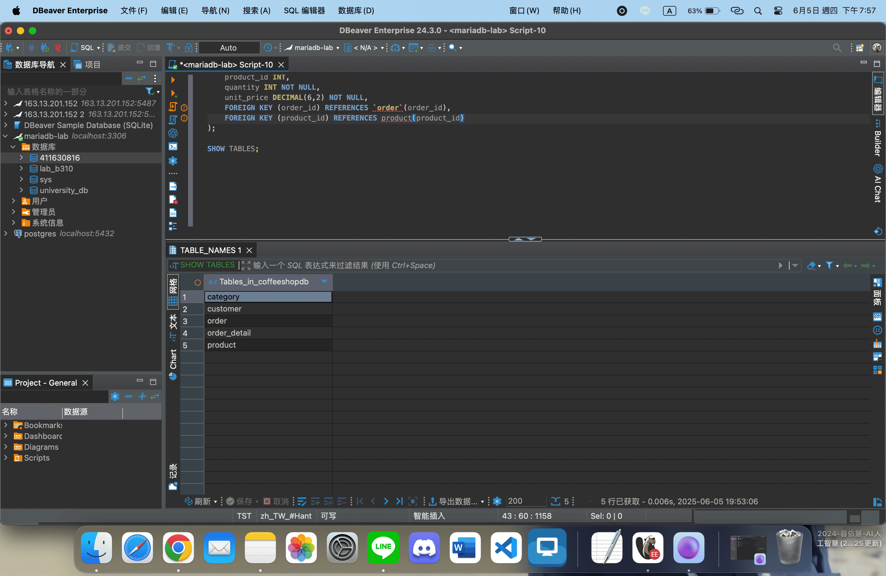

重點查詢
```sql
-- 熱銷飲品排行
SELECT 
    p.name AS product_name,
    SUM(od.quantity) AS total_quantity
FROM 
    order_detail od
JOIN 
    product p ON od.product_id = p.product_id
GROUP BY 
    od.product_id
ORDER BY 
    total_quantity DESC;
```
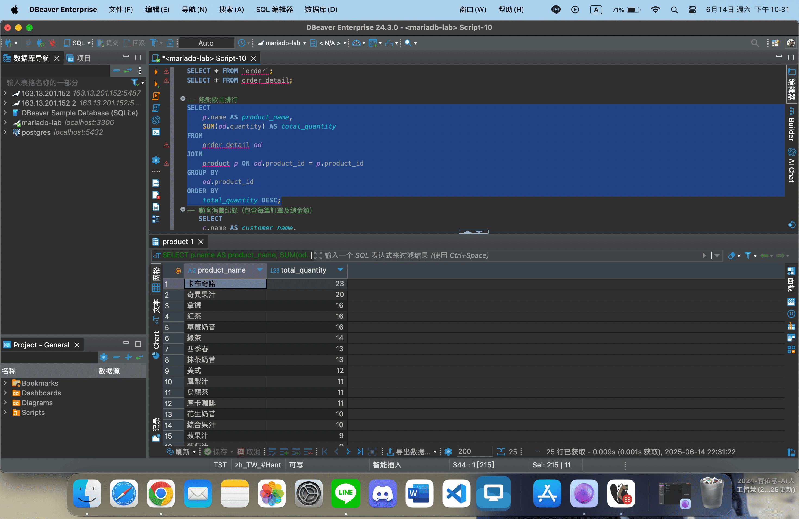
```sql
-- 顧客消費紀錄（包含每筆訂單及總金額）
SELECT 
    c.name AS customer_name,
    o.order_id,
    o.order_time,
    SUM(od.quantity * od.unit_price) AS order_total
FROM 
    `order` o
JOIN 
    customer c ON o.customer_id = c.customer_id
JOIN 
    order_detail od ON o.order_id = od.order_id
GROUP BY 
    o.order_id
ORDER BY 
    o.order_time;
```
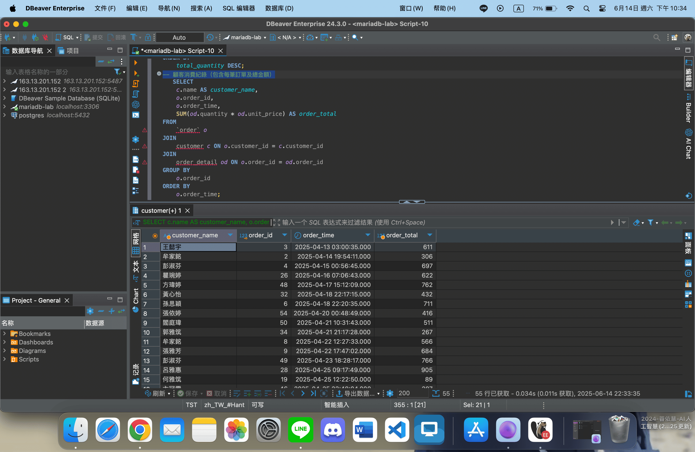
```sql
-- 每日營業額（以日期為單位）
SELECT 
    DATE(order_time) AS date,
    COUNT(DISTINCT o.order_id) AS total_orders,
    SUM(od.quantity * od.unit_price) AS total_revenue
FROM 
    `order` o
JOIN 
    order_detail od ON o.order_id = od.order_id
GROUP BY 
    DATE(order_time)
ORDER BY 
    date;
```
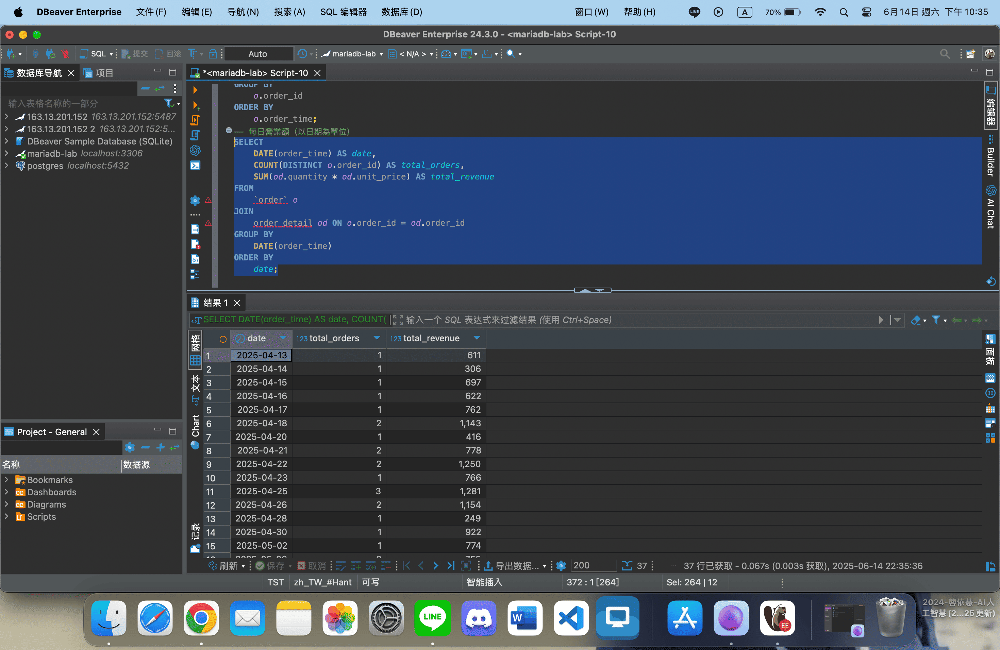
```sql
-- 每月商品統計（商品、總數量、商品總銷售額）
SELECT 
    DATE_FORMAT(o.order_time, '%Y-%m') AS month,
    p.name AS product_name,
    SUM(od.quantity) AS total_quantity,
    SUM(od.quantity * od.unit_price) AS total_sales
FROM 
    `order` o
JOIN 
    order_detail od ON o.order_id = od.order_id
JOIN 
    product p ON od.product_id = p.product_id
GROUP BY 
    month, od.product_id
ORDER BY 
    month, total_sales DESC;
```
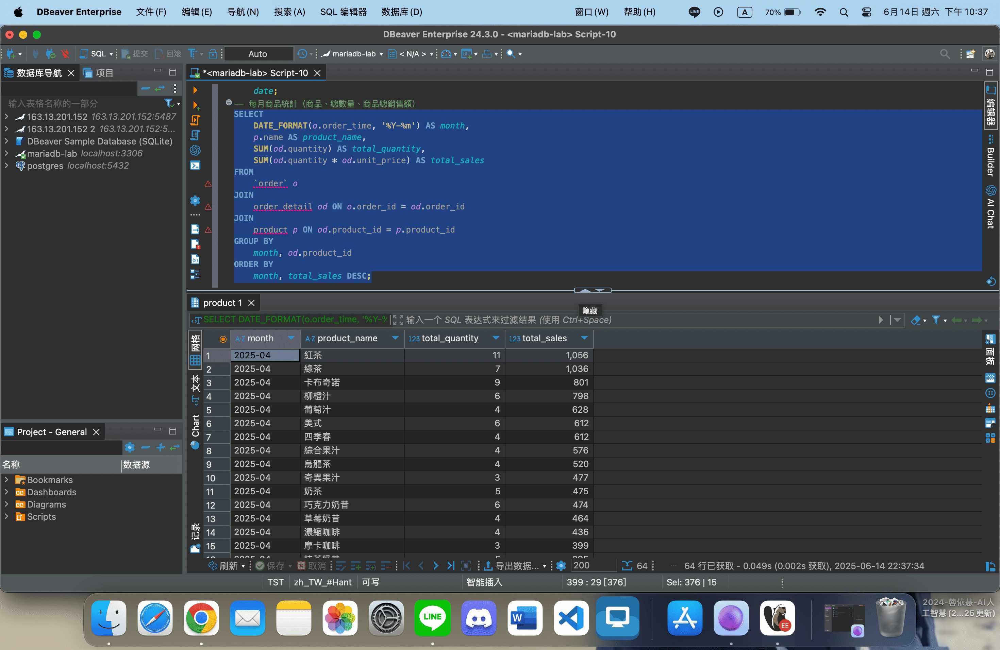
```sql
-- 每月總營收（整體月營業額）
SELECT 
    DATE_FORMAT(o.order_time, '%Y-%m') AS month,
    SUM(od.quantity * od.unit_price) AS monthly_total_sales
FROM 
    `order` o
JOIN 
    order_detail od ON o.order_id = od.order_id
GROUP BY 
    month
ORDER BY 
    month;
```
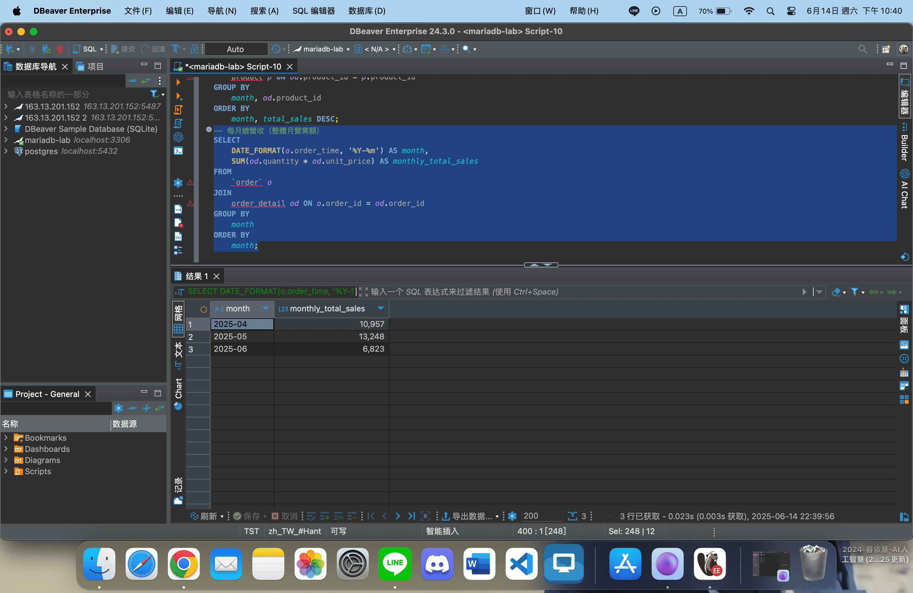
2. 資料表建立與基本操作
Schema 建立與初始資料插入 (CREATE TABLE, INSERT)。
已完成
索引與效能考量：為常用查詢欄位建立索引。
```sql
-- 為查詢產品資訊加速
CREATE INDEX idx_orderdetail_product ON order_detail(product_id);

-- 為查詢訂單明細加速
CREATE INDEX idx_order_customer ON `order`(customer_id);

-- 為統計日期查詢加速
CREATE INDEX idx_order_time ON `order`(order_time);

```
交易 (Transaction) 機制：BEGIN、COMMIT、ROLLBACK 範例。
正常交易流程（使用 COMMIT）
```sql
START TRANSACTION;
-- 插入訂單資料
INSERT INTO `order` (customer_id, order_time, dine_type)
VALUES (5, NOW(), '內用');
-- 取得剛剛插入的訂單 ID
SET @last_order_id = LAST_INSERT_ID();
-- 插入對應的訂單明細資料
INSERT INTO order_detail (order_id, product_id, quantity, unit_price)
VALUES 
(@last_order_id, 2, 2, 102.00),
(@last_order_id, 5, 1, 109.00);
-- 提交交易
COMMIT;
-- 查最後幾筆明細
SELECT * FROM order_detail
ORDER BY order_detail_id DESC
LIMIT 5;
```
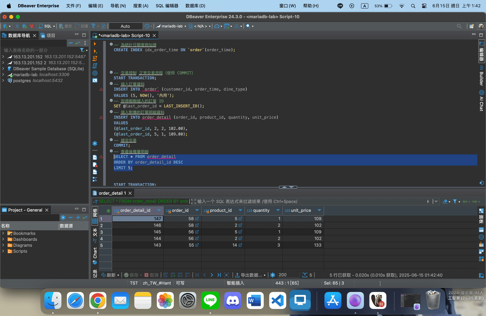
模擬錯誤 → 自動 ROLLBACK
```sql
START TRANSACTION;
-- 插入錯誤訂單（customer_id = 999 不存在）
INSERT INTO `order` (customer_id, order_time, dine_type)
VALUES (999, NOW(), '內用');

-- 插入失敗，MariaDB 自動觸發 rollback
-- 無需手動寫 ROLLBACK，但你也可以手動測試：
-- ROLLBACK;
```
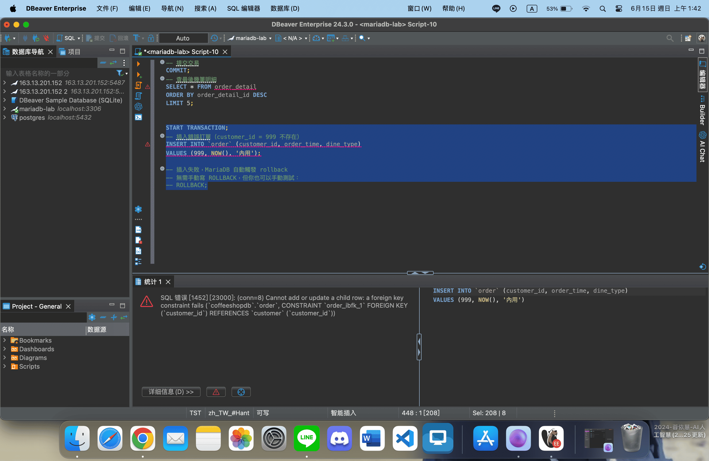
3. 進階 SQL 功能應用
複雜查詢與子查詢：聚合函數、GROUP BY、HAVING、視圖 (View)。
```sql
SELECT 
    p.name AS product_name,
    SUM(od.quantity) AS total_quantity
FROM 
    order_detail od
JOIN 
    product p ON od.product_id = p.product_id
GROUP BY 
    od.product_id
HAVING 
    total_quantity > 20
ORDER BY 
    total_quantity DESC;
```
透過 GROUP BY 分組商品，搭配 SUM() 計算每種商品的總銷售數量，並以 HAVING 篩選出總銷量超過 20 的熱銷商品。
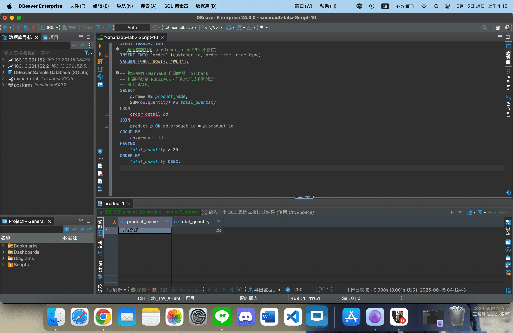
將剛才的查詢結果建立成一個「可重複查詢的視圖」，稱為 hot_products_view
```sql
CREATE OR REPLACE VIEW hot_products_view AS
SELECT 
    p.name AS product_name,
    SUM(od.quantity) AS total_quantity
FROM 
    order_detail od
JOIN 
    product p ON od.product_id = p.product_id
GROUP BY 
    od.product_id
HAVING 
    total_quantity > 20;
```
```sql
SELECT * FROM hot_products_view;
```
Stored Procedure / Function：實作商業邏輯或報表計算。
Stored Procedure（查詢指定月份總銷售額）:讓使用者輸入「月份」（如 '2025-06'），系統幫你查該月總銷售額
```sql
CREATE PROCEDURE sp_monthly_sales_report(IN input_month VARCHAR(7))
BEGIN
  SELECT 
    DATE_FORMAT(o.order_time, '%Y-%m') AS month,
    SUM(od.quantity * od.unit_price) AS total_sales
  FROM `order` o
  JOIN order_detail od ON o.order_id = od.order_id
  WHERE DATE_FORMAT(o.order_time, '%Y-%m') = input_month
  GROUP BY month;
END;
```
```sql
CALL sp_monthly_sales_report('2025-06');
```
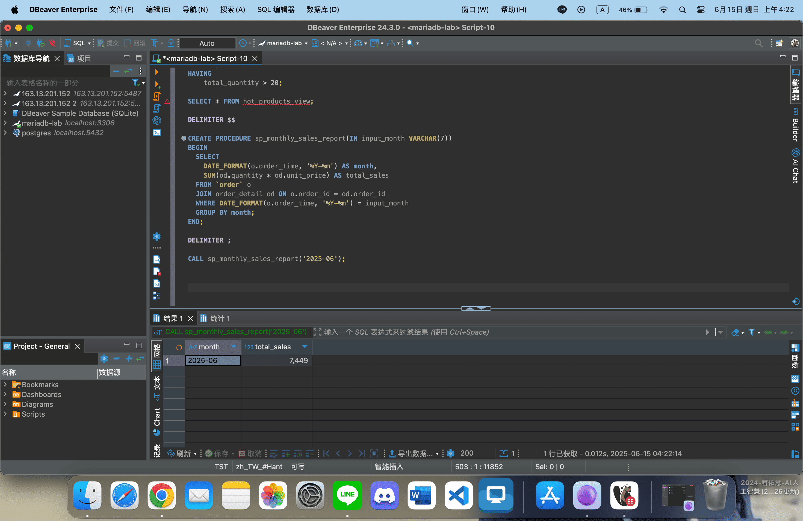
```sql
SHOW PROCEDURE STATUS WHERE Db = 'coffeeshopdb';
```
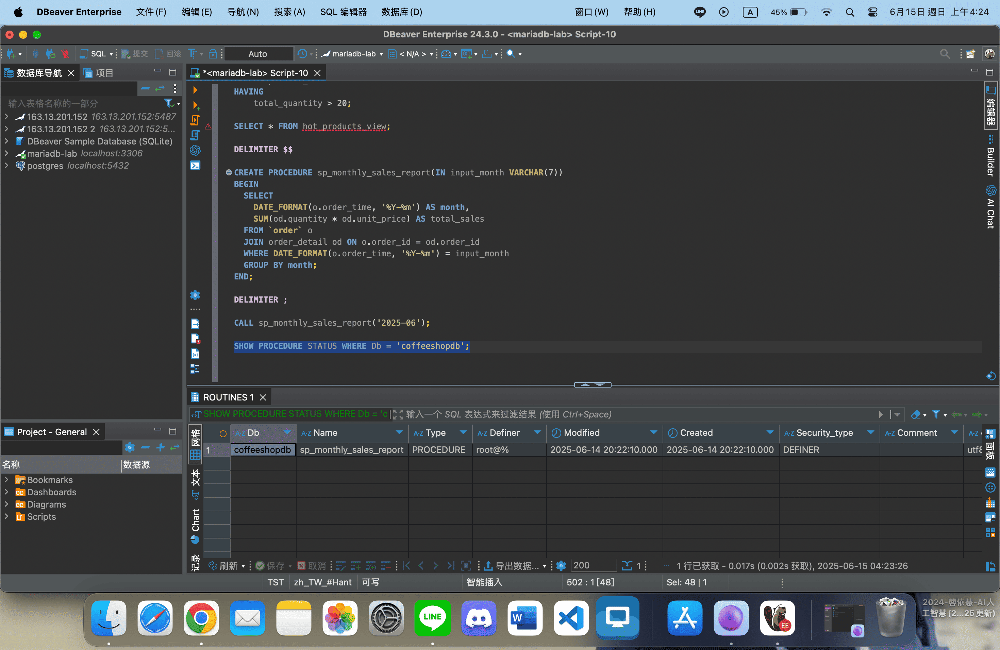
Function
傳入一個 order_id，回傳該訂單的總金額
```sql
CREATE FUNCTION fn_total_by_order(orderId INT)
RETURNS DECIMAL(10,2)
DETERMINISTIC
BEGIN
  DECLARE total DECIMAL(10,2);
  SELECT SUM(quantity * unit_price)
  INTO total
  FROM order_detail
  WHERE order_id = orderId;
  RETURN total;
END;
```
```sql
SELECT fn_total_by_order(10);
```
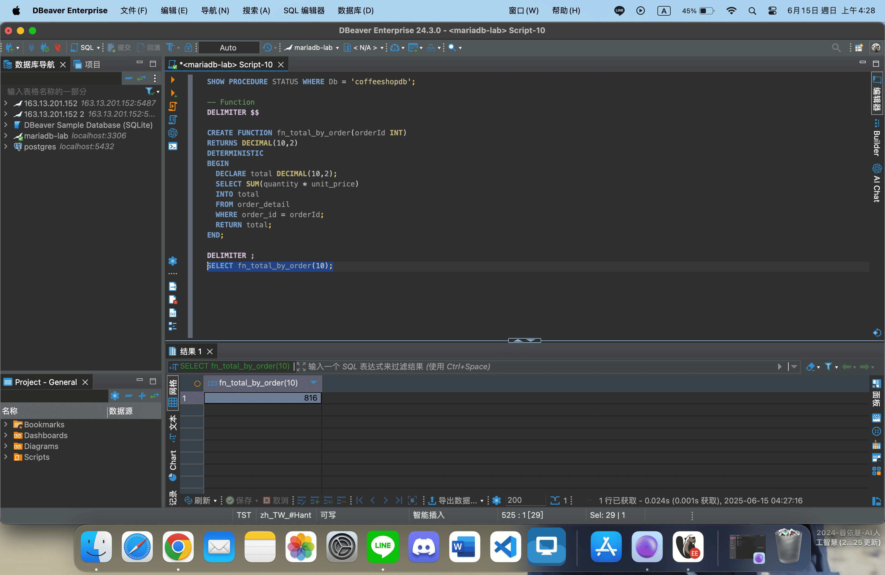
Trigger：自動處理插入、更新、刪除事件。
Trigger（訂單新增時寫入日誌）
建立日誌表
```sql
CREATE TABLE order_log (
  log_id INT AUTO_INCREMENT PRIMARY KEY,
  order_id INT,
  log_time DATETIME DEFAULT CURRENT_TIMESTAMP,
  action VARCHAR(20)
);
```
建立 Trigger
```sql
CREATE TRIGGER trg_log_order_insert
AFTER INSERT ON `order`
FOR EACH ROW
BEGIN
  INSERT INTO order_log (order_id, action)
  VALUES (NEW.order_id, 'INSERTED');
END;
```
Trigger（自動更新顧客最近消費時間）
加欄位到 customer 表
```sql
ALTER TABLE customer ADD COLUMN last_order_time DATETIME;
```
建立 Trigger
```sql
CREATE TRIGGER trg_update_last_order
AFTER INSERT ON `order`
FOR EACH ROW
BEGIN
  UPDATE customer
  SET last_order_time = NEW.order_time
  WHERE customer_id = NEW.customer_id;
END;
```
安全性與權限管理 (可選)：建立 ROLE、分配權限。
建立角色
```sql
CREATE USER 'clerk_user'@'192.168.215.%' IDENTIFIED BY 'clerkpass';
CREATE USER 'manager_user'@'192.168.215.%' IDENTIFIED BY 'managerpass';
```
指定權限
```sql
-- clerk_user 只能查詢與新增
GRANT SELECT, INSERT ON coffeeshopdb.* TO 'clerk_user'@'192.168.215.%';
-- manager_user 擁有完整權限
GRANT ALL PRIVILEGES ON coffeeshopdb.* TO 'manager_user'@'192.168.215.%';
```
```sql
FLUSH PRIVILEGES;
```
指定帳號使用角色
Trigger：自動處理插入、更新、刪除事件。
Trigger（訂單新增時寫入日誌）
建立日誌表
```sql
CREATE TABLE order_log (
  log_id INT AUTO_INCREMENT PRIMARY KEY,
  order_id INT,
  log_time DATETIME DEFAULT CURRENT_TIMESTAMP,
  action VARCHAR(20)
);
```
建立 Trigger
```sql
CREATE TRIGGER trg_log_order_insert
AFTER INSERT ON `order`
FOR EACH ROW
BEGIN
  INSERT INTO order_log (order_id, action)
  VALUES (NEW.order_id, 'INSERTED');
END;
```
Trigger（自動更新顧客最近消費時間）
加欄位到 customer 表
```sql
ALTER TABLE customer ADD COLUMN last_order_time DATETIME;
```
建立 Trigger
```sql
CREATE TRIGGER trg_update_last_order
AFTER INSERT ON `order`
FOR EACH ROW
BEGIN
  UPDATE customer
  SET last_order_time = NEW.order_time
  WHERE customer_id = NEW.customer_id;
END;
```
安全性與權限管理 (可選)：建立 ROLE、分配權限。
建立角色
```sql
CREATE USER 'clerk_user'@'192.168.215.%' IDENTIFIED BY 'clerkpass';
CREATE USER 'manager_user'@'192.168.215.%' IDENTIFIED BY 'managerpass';
```
指定權限
```sql
-- clerk_user 只能查詢與新增
GRANT SELECT, INSERT ON coffeeshopdb.* TO 'clerk_user'@'192.168.215.%';
-- manager_user 擁有完整權限
GRANT ALL PRIVILEGES ON coffeeshopdb.* TO 'manager_user'@'192.168.215.%';
```
```sql
FLUSH PRIVILEGES;
```
指定帳號使用角色
Trigger：自動處理插入、更新、刪除事件。
Trigger（訂單新增時寫入日誌）
建立日誌表
```sql
CREATE TABLE order_log (
  log_id INT AUTO_INCREMENT PRIMARY KEY,
  order_id INT,
  log_time DATETIME DEFAULT CURRENT_TIMESTAMP,
  action VARCHAR(20)
);
```
建立 Trigger
```sql
CREATE TRIGGER trg_log_order_insert
AFTER INSERT ON `order`
FOR EACH ROW
BEGIN
  INSERT INTO order_log (order_id, action)
  VALUES (NEW.order_id, 'INSERTED');
END;
```
Trigger（自動更新顧客最近消費時間）
加欄位到 customer 表
```sql
ALTER TABLE customer ADD COLUMN last_order_time DATETIME;
```
建立 Trigger
```sql
CREATE TRIGGER trg_update_last_order
AFTER INSERT ON `order`
FOR EACH ROW
BEGIN
  UPDATE customer
  SET last_order_time = NEW.order_time
  WHERE customer_id = NEW.customer_id;
END;
```
安全性與權限管理 (可選)：建立 ROLE、分配權限。
建立角色
```sql
CREATE USER 'clerk_user'@'192.168.215.%' IDENTIFIED BY 'clerkpass';
CREATE USER 'manager_user'@'192.168.215.%' IDENTIFIED BY 'managerpass';
```
指定權限
```sql
-- clerk_user 只能查詢與新增
GRANT SELECT, INSERT ON coffeeshopdb.* TO 'clerk_user'@'192.168.215.%';
-- manager_user 擁有完整權限
GRANT ALL PRIVILEGES ON coffeeshopdb.* TO 'manager_user'@'192.168.215.%';
```
```sql
FLUSH PRIVILEGES;
```
指定帳號使用角色
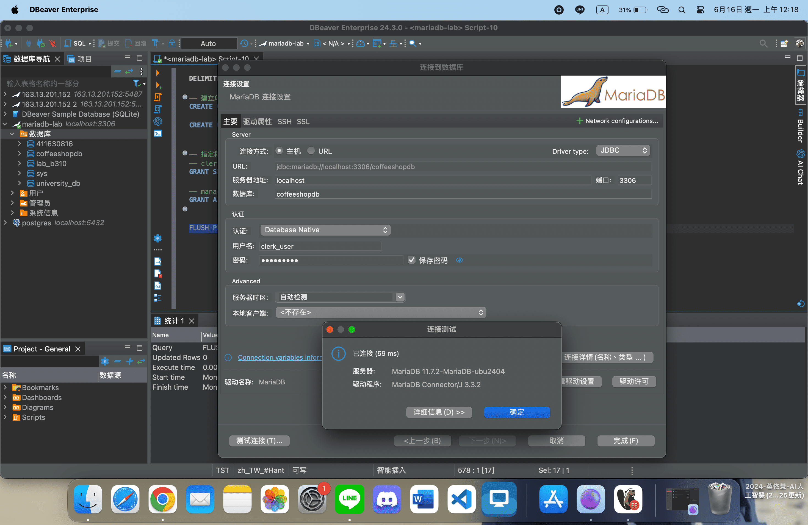
系統使用者 clerk_user 經授權後具備 SELECT、INSERT 權限，實測無法執行 DELETE 或 UPDATE 指令，顯示角色權限限制設定正確生效。（如下）
```sql
SELECT * FROM product;
```
系統使用者 clerk_user 經授權後具備 SELECT、INSERT 權限，實測無法執行 DELETE 或 UPDATE 指令，顯示角色權限限制設定正確生效。（如下）
```sql
SELECT * FROM product;
```
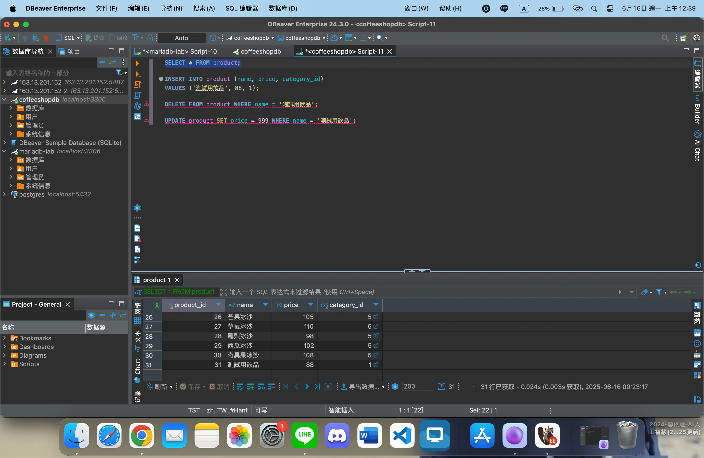
```sql
INSERT INTO product (name, price, category_id) 
VALUES ('測試用飲品', 88, 1);
```
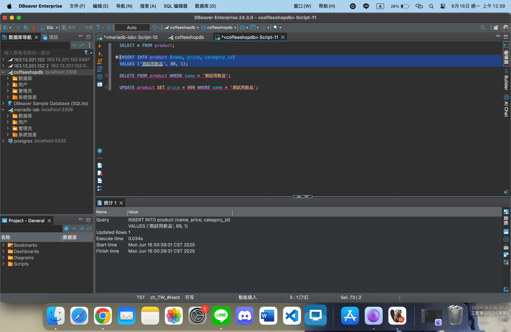
以上兩個功能都是clerk擁有的權限所以順利執行
```sql
DELETE FROM product WHERE name = '測試用飲品';
```
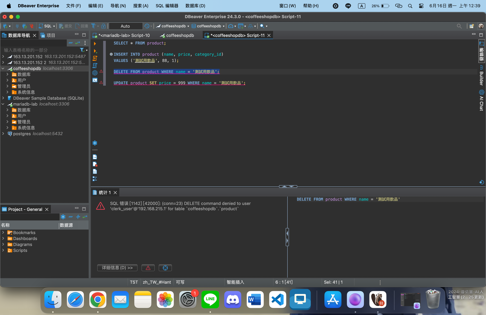
```sql
UPDATE product SET price = 999 WHERE name = '測試用飲品';
```
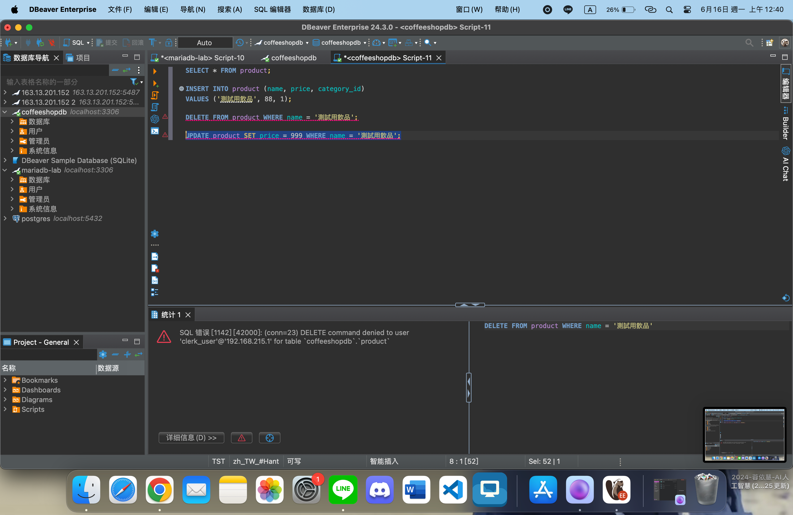
以上兩個功能都是clerk沒有的權限所以無法成功執行